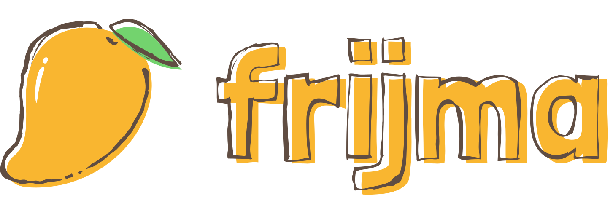

### A [web app](https://todoran.dev/frijma) dedicated to reducing global food waste, one receipt at a time.

## Why frijma
According to the USDA, it is estimated that nearly 40% of the U.S. food supply is wasted every single year. Aside from the social and humanitarian issues associated with this problem, food waste also contributes to the climate crisis; rotting food in landfills is a major producer of methane, a greenhouse gas 25 times more potent than carbon dioxide. Unlike many climate issues, however, food waste is a problem that can and must be solved at an individual consumer level. This is where frijma comes in.

## What it does
Our web app allows users to scan grocery receipts using their phone camera, keeps track of their expiration dates with easily digestible visuals, and also provides recipe inspiration for efficient meal planning--ultimately reducing food waste due to expired food.

## How we built it
Our app consists of 5 main parts:
1. Computer vision & image processing for receipt scanning.
2. Data set aggregation and synthesizing for food expiration data.
3. Algorithms for text parsing and search querying/filtering.
4. Calling API endpoints to gather recipe data.
5. Stunning and intuitive UI and data visualization for easy use.

 
By: Sho Kiami, Zach Chapman, Nicholas Bradley, Stefan Todoran.

Submitted to DubHacks'22.
